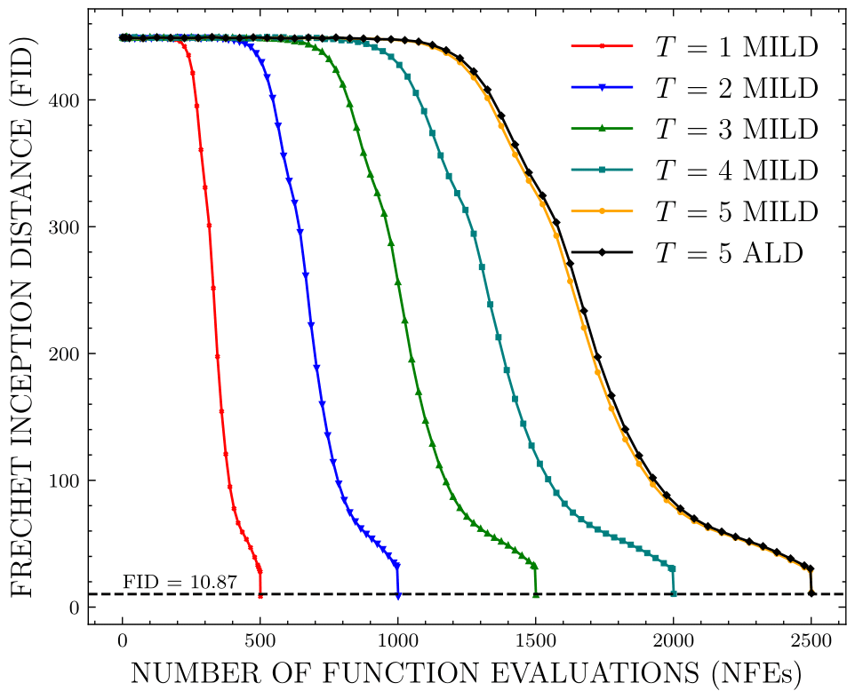
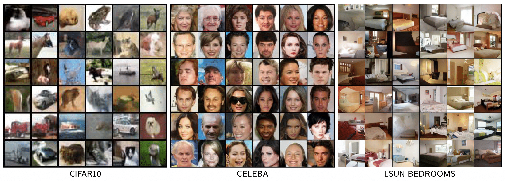
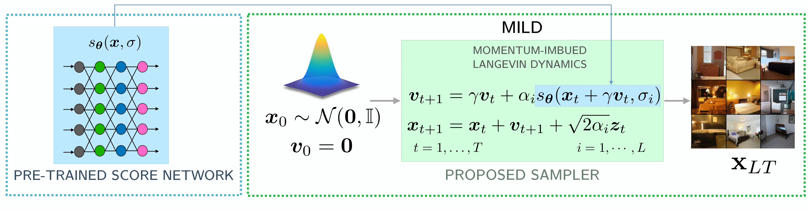

# Momentum Imbued Langevin Dynamics (MILD)

This repo contains the official implementation for the paper [Momentum Imbued Langevin Dynamics (MILD)](https://ieeexplore.ieee.org/abstract/document/10446376). Project page can be found in [this link](https://nishitneema.github.io/publications/mild/).

-----------------------------------------------------------------------------------------

Score-based generative models have emerged as state-of-the-art generative models. In this paper, we introduce a novel sampling scheme that can be combined with pre-trained score-based diffusion models to speed up sampling by a factor of two to five in terms of the number of function evaluations (NFEs) with a superior Frechet Inception distance (FID), compared to Annealed Langevin dynamics in [noise-conditional score network (NCSN)](https://arxiv.org/abs/1907.05600) and [improved noise-conditional score network (NCSN++)](https://arxiv.org/pdf/2006.09011.pdf). The proposed sampling algorithm is inspired by momentum-based accelerated gradient descent used in convex optimization techniques.

We validate the sampling efficiency of the proposed algorithm in terms of FID on CIFAR-10 and CelebA datasets.

**Note**: Throughout the literature NCSNv2 and NCSN++ are used interchangeably, so consider both to be referring to same model and NCSNv1 is just NCSN. 

<centre></centre>

(ALD: Annealed Langevin Dynamics, MILD: Momentum Imbued Langevin Dynamics and 'T' denotes # timesteps for each noise level)



(**From left to right**: Our samples on Cifar10 32px, CelebA 64px, and LSUN bedroom 128px obtained from NCSN++.)

## Running Experiments

### Dependencies

Run the following to install all necessary python packages for our code.

```bash
pip install -r requirements.txt
```

### Project structure

`main.py` is the file that you should run for both training and sampling. Execute ```python main.py --help``` to get its usage description:

```
usage: main.py [-h] --config CONFIG [--seed SEED] [--exp EXP] --doc DOC
               [--comment COMMENT] [--verbose VERBOSE] [--test] [--mild_sample]
               [--fast_fid] [--resume_training] [-i IMAGE_FOLDER] [--ni]
               [--graph_data] [--ncsn_sample]

optional arguments:
  -h, --help            show this help message and exit
  --config CONFIG       Path to the config file
  --seed SEED           Random seed
  --exp EXP             Path for saving running related data.
  --doc DOC             A string for documentation purpose. Will be the name
                        of the log folder.
  --comment COMMENT     A string for experiment comment
  --verbose VERBOSE     Verbose level: info | debug | warning | critical
  --test                Whether to test the model
  --mild_sample         Whether to produce samples from the MILD model
  --ncsn_sample         Whether to produce samples from the NCSN model
  --fast_fid            Whether to do fast fid test
  --find_fid            Whether to find fid of sampling strategy
  --resume_training     Whether to resume training
  -i IMAGE_FOLDER, --image_folder IMAGE_FOLDER
                        The folder name of samples
  --ni                  No interaction. Suitable for Slurm Job launcher
  --graph_data          Use it to generate data points for plotting graph
  
```

Configuration files are in `config/`. You don't need to include the prefix `config/` when specifying  `--config` . All files generated when running the code is under the directory specified by `--exp`. They are structured as:

```bash
<exp> # a folder named by the argument `--exp` given to main.py
├── datasets # all dataset files
├── logs # contains checkpoints and samples produced during training
│   └── <doc> # a folder named by the argument `--doc` specified to main.py
│      ├── checkpoint_x.pth # the checkpoint file saved at the x-th training iteration
│      ├── config.yml # the configuration file for training this model
│      ├── stdout.txt # all outputs to the console during training
│      └── samples # all samples produced during training
├── fid_samples # contains all samples generated for fast fid computation
│   └── <i> # a folder named by the argument `-i` specified to main.py
│      └── ckpt_x # a folder of image samples generated from checkpoint_x.pth
├── image_samples # contains generated samples
│   └── <i>
│       └── image_grid_x.png # samples generated from checkpoint_x.pth       
└── tensorboard # tensorboard files for monitoring training
    └── <doc> # this is the log_dir of tensorboard
```

### Training

For example, we can train an NCSN++ on LSUN bedroom by running the following

```bash
python main.py --config bedroom.yml --doc bedroom
```

Log files will be saved in `<exp>/logs/bedroom`.

, or we can train NCSN by running the following

```bash
python main.py --runner AnnealRunner --config anneal.yml --doc cifar10
```

Then the model will be trained according to the configuration files in configs/anneal.yml. The log files will be stored in `<exp>/logs/cifar10`.

### Sampling



(Figure showing how our sampling method works)

If we want to sample from NCSN++ on LSUN bedroom, we can edit `bedroom.yml` to specify the `ckpt_id` under the group `sampling`, and then run the following

```bash
python main.py --sample --config bedroom.yml -i bedroom
```

Samples will be saved in `<exp>/image_samples/bedroom`.

We can interpolate between different samples (see more details in the paper). Just set `interpolation` to `true` and an appropriate `n_interpolations` under the group of `sampling` in `bedroom.yml`. We can also perform other tasks such as inpainting. Usages should be quite obvious if you read the code and configuration files carefully.

### Computing FID values quickly for a range of checkpoints

We can specify `begin_ckpt` and `end_ckpt` under the `fast_fid` group in the configuration file. For example, by running the following command, we can generate a small number of samples per checkpoint within the range `begin_ckpt`-`end_ckpt` for a quick (and rough) FID evaluation.

```shell
python main.py --fast_fid --config bedroom.yml -i bedroom
```

You can find samples in `<exp>/fid_samples/bedroom`.

## Plotting the graph for FID values
```shell
python main.py --graph_data --config celeba.yml -i bedroom
```
Above command finds the FID of images generated after every timestep for `L*T` timesteps. T(num_time_steps) can be found in config file.
After running for different T values, we can plot graph like in the notebook `graph.ipynb`

## 1D and 2D data sampling
`MILD_1D_2D.ipynb` will walk us through the applying MILD to 1D and 2D known density functions and can clearly see the speedup acheived in sampling strategy against Unadjusted Langevin Dynamics.

## Pretrained Checkpoints

Link: https://drive.google.com/drive/folders/1217uhIvLg9ZrYNKOR3XTRFSurt4miQrd?usp=sharing

You can produce samples using it on all datasets we tested in the paper. It assumes the `--exp` argument is set to `exp`.

## BibTex
If you find our repo helpful, please consider citing our paper :)
```bib
@inproceedings{shetty2024momentum,
  title={Momentum-Imbued Langevin Dynamics (MILD) for Faster Sampling},
  author={Shetty, Nishanth and Bandla, Manikanta and Neema, Nishit and Asokan, Siddarth and Seelamantula, Chandra Sekhar},
  booktitle={ICASSP 2024-2024 IEEE International Conference on Acoustics, Speech and Signal Processing (ICASSP)},
  pages={6635--6639},
  year={2024},
  organization={IEEE}
}
```
